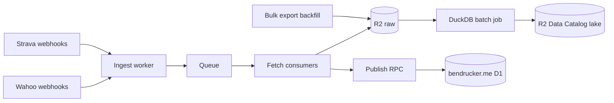

# Activity Hub

System of record for my activity data. Ingests rides and other workouts from Strava and Wahoo, archives the original files in R2, builds an analytics lake with DuckDB, and publishes a feed subset to [bendrucker.me](https://github.com/bendrucker/bendrucker.me).

## Why

Strava holds the presentation layer (titles, photos, social) but never returns original files and keeps tightening API access. Wahoo has the raw FIT files but none of the curation. Neither is a durable home for a decade of training data. This project owns the data: raw immutable files in object storage, replayable transforms, and queryable history that outlives any one vendor.

## Architecture

Workers handle events: webhook receipt, raw archival, and publishing the small feed subset at event time. DuckDB handles columns: a batch job (GitHub Actions cron, also runnable locally) parses FIT files and maintains Iceberg tables on R2. The raw bucket is the system of record. Everything downstream can be rebuilt from it.

See [docs/design.md](docs/design.md) for the full design and [docs/sources.md](docs/sources.md) for source API constraints.

## Secrets

Inventory of every credential the system needs and where it lives.

| Secret                                    | Location                               | Consumer                                                                                    |
| ----------------------------------------- | -------------------------------------- | ------------------------------------------------------------------------------------------- |
| `CLOUDFLARE_API_TOKEN`                    | GitHub Actions repo secret             | `deploy.yml` (migrations + `wrangler deploy`)                                               |
| `STRAVA_CLIENT_SECRET`                    | Worker secret (`wrangler secret put`)  | Strava OAuth + webhooks ([#7](https://github.com/bendrucker/activity-hub/issues/7))         |
| `STRAVA_VERIFY_TOKEN`                     | Worker secret (`wrangler secret put`)  | Webhook subscription validation ([#8](https://github.com/bendrucker/activity-hub/issues/8)) |
| `WAHOO_CLIENT_ID` / `WAHOO_CLIENT_SECRET` | Worker secrets (`wrangler secret put`) | Wahoo OAuth + webhooks ([#11](https://github.com/bendrucker/activity-hub/issues/11))        |
| R2 token: read `activity-hub-raw`         | GitHub Actions repo secret             | DuckDB batch job ([#14](https://github.com/bendrucker/activity-hub/issues/14))              |
| R2 token: write `activity-hub-lake`       | GitHub Actions repo secret             | DuckDB batch job ([#14](https://github.com/bendrucker/activity-hub/issues/14))              |

`STRAVA_CLIENT_ID` and `STRAVA_ATHLETE_ID` are public identifiers, committed as
vars in `wrangler.jsonc`. `STRAVA_SUBSCRIPTION_ID` is also a committed var,
left empty until `scripts/strava-subscription.ts create` creates the push
subscription and returns its id. A value for `STRAVA_VERIFY_TOKEN` can be
generated with `openssl rand -hex 16`.

R2 API tokens apply a single permission level across the buckets they cover, so
raw reads and lake writes are two separate tokens. Both get created in the
Cloudflare dashboard when the batch job lands.

## Status

Design phase. Supersedes the Strava pipeline previously planned inside bendrucker.me ([#100](https://github.com/bendrucker/bendrucker.me/issues/100)).
