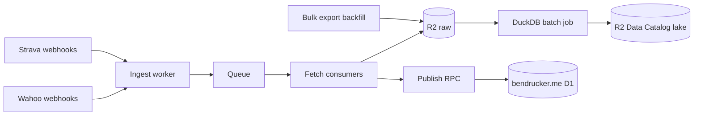

# Activity Hub

System of record for my activity data. Ingests rides and other workouts from Strava and Wahoo, archives the original files in R2, builds an analytics lake with DuckDB, and publishes a feed subset to [bendrucker.me](https://github.com/bendrucker/bendrucker.me).

## Why

Strava holds the presentation layer (titles, photos, social) but never returns original files and keeps tightening API access. Wahoo has the raw FIT files but none of the curation. Neither is a durable home for a decade of training data. This project owns the data: raw immutable files in object storage, replayable transforms, and queryable history that outlives any one vendor.

## Architecture


```mermaid
flowchart LR
    strava[Strava webhooks] --> ingest[Ingest worker]
    wahoo[Wahoo webhooks] --> ingest
    export[Bulk export backfill] --> raw
    ingest --> queue[Queue] --> fetch[Fetch consumers] --> raw[(R2 raw)]
    raw --> duck[DuckDB batch job] --> lake[(R2 Data Catalog lake)]
    fetch --> publish[Publish RPC] --> site[(bendrucker.me D1)]
```

Workers handle events: webhook receipt, raw archival, and publishing the small feed subset at event time. DuckDB handles columns: a batch job (GitHub Actions cron, also runnable locally) parses FIT files and maintains Iceberg tables on R2. The raw bucket is the system of record. Everything downstream can be rebuilt from it.

See [docs/design.md](docs/design.md) for the full design and [docs/sources.md](docs/sources.md) for source API constraints.

## Secrets

Inventory of every credential the system needs and where it lives.

| Secret                                    | Location                               | Consumer                                                                                               |
| ----------------------------------------- | -------------------------------------- | ------------------------------------------------------------------------------------------------------ |
| `ADMIN_TOKEN`                             | Worker secret (`wrangler secret put`)  | Manual triggers (`POST /admin/reconcile`, `POST /admin/wahoo-backfill`, `POST /admin/strava-backfill`) |
| `CLOUDFLARE_API_TOKEN`                    | GitHub Actions repo secret             | `deploy.yml` (migrations + `wrangler deploy`)                                                          |
| `STRAVA_CLIENT_SECRET`                    | Worker secret (`wrangler secret put`)  | Strava OAuth token refresh and webhook subscription management                                         |
| `STRAVA_VERIFY_TOKEN`                     | Worker secret (`wrangler secret put`)  | Webhook subscription validation ([#8](https://github.com/bendrucker/activity-hub/issues/8))            |
| `WAHOO_CLIENT_ID` / `WAHOO_CLIENT_SECRET` | Worker secrets (`wrangler secret put`) | Wahoo OAuth + webhooks ([#11](https://github.com/bendrucker/activity-hub/issues/11))                   |
| `WAHOO_WEBHOOK_TOKEN`                     | Worker secret (`wrangler secret put`)  | Wahoo webhook receiver ([#11](https://github.com/bendrucker/activity-hub/issues/11))                   |
| R2 token: read `activity-hub-raw`         | GitHub Actions repo secret             | DuckDB batch job ([#14](https://github.com/bendrucker/activity-hub/issues/14))                         |
| R2 token: write `activity-hub-lake`       | GitHub Actions repo secret             | DuckDB batch job ([#14](https://github.com/bendrucker/activity-hub/issues/14))                         |

`STRAVA_CLIENT_ID` and `STRAVA_ATHLETE_ID` are public identifiers, committed as
vars in `wrangler.jsonc`. `STRAVA_SUBSCRIPTION_ID` is also a committed var,
left empty until `scripts/strava-subscription.ts create` creates the push
subscription and returns its id. A value for `STRAVA_VERIFY_TOKEN` can be
generated with `openssl rand -hex 16`.

R2 API tokens apply a single permission level across the buckets they cover, so
raw reads and lake writes are two separate tokens. Both get created in the
Cloudflare dashboard when the batch job lands.

## Access

The worker serves only `hub.bendrucker.me`. Behind `/admin/*` and `/auth/*` sits
a Cloudflare Access application, which resolves identity before a request ever
reaches the worker. `ADMIN_TOKEN` still guards the admin routes underneath it.

`/webhooks/*` is deliberately outside both applications. Strava and Wahoo post
server to server, with no browser and no identity to challenge, so an Access
policy there would silently drop every event. Those routes authenticate on the
provider's own terms instead: Strava against `STRAVA_SUBSCRIPTION_ID`, Wahoo
against `WAHOO_WEBHOOK_TOKEN`.

Reaching `/admin/*` from a script means a service token rather than a browser
login. Its two header values come from Terraform outputs in
[bendrucker/infrastructure](https://github.com/bendrucker/infrastructure):

```sh
curl -H "CF-Access-Client-Id: $(terraform output -raw activity_hub_access_client_id)" \
     -H "CF-Access-Client-Secret: $(terraform output -raw activity_hub_access_client_secret)" \
     -H "Authorization: Bearer $ADMIN_TOKEN" \
     https://hub.bendrucker.me/admin/consume-log
```

The DNS record, the worker route, the Access applications, and the service token
are all Terraform-managed in that repository. That workspace is VCS-connected, so
applies run from a merge rather than from a local `terraform apply`.

## Archive Coverage

Every activity needs archived bytes or the transform job has nothing to parse for it. Two prefixes supply them. The bulk export writes `original` for history, and the webhook path writes `streams` for anything ingested live. A source row holding neither key has nothing at all.

`POST /admin/strava-backfill` walks that population and enqueues a refresh for each row, which fetches detail, streams, and photos from the Strava API. Raw keys merge on upsert, so a refresh never displaces an `original` it finds. The walk is keyset-paged because the queue fills rows asynchronously and an offset would step over rows that shifted:

```sh
curl -X POST -H "Authorization: Bearer $ADMIN_TOKEN" \
  https://hub.bendrucker.me/admin/strava-backfill
# {"enqueued":100,"remaining":300,"done":false,"nextCursor":"1234567890"}
```

Feed `nextCursor` back as `?cursor=` until `done` is true. Each refresh costs up to three Strava reads against a 1,000/day budget, and the queue parks the remainder when that budget runs out.

A Wahoo workout whose summary carries no file has no equivalent recovery. Strava's API never returns original files either, so an activity that reaches the hub through Strava alone has streams as its best available fidelity until the next bulk export.

## Status

The Strava pipeline is live. The historical export is imported, OAuth and webhooks run, and a daily reconciliation cron catches anything webhooks miss. Wahoo is in progress ([#11](https://github.com/bendrucker/activity-hub/issues/11)). The lake and DuckDB transform job haven't started ([#13](https://github.com/bendrucker/activity-hub/issues/13), [#14](https://github.com/bendrucker/activity-hub/issues/14)).

Supersedes the Strava pipeline previously planned inside bendrucker.me ([#100](https://github.com/bendrucker/bendrucker.me/issues/100)).
