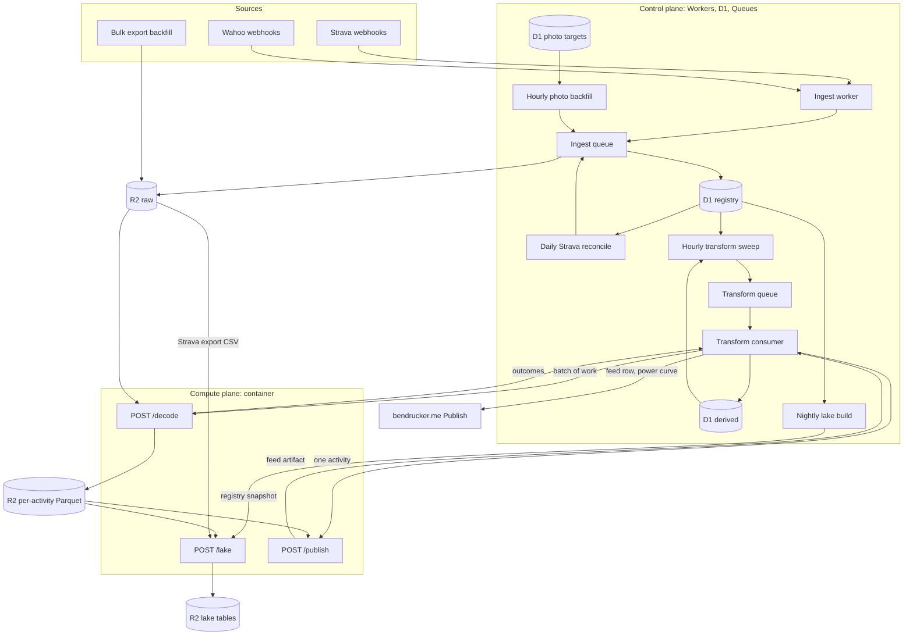
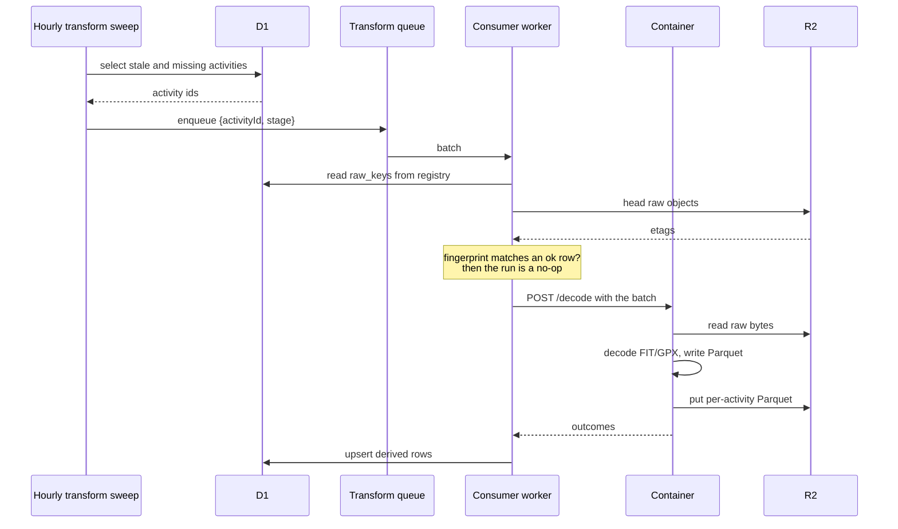

# Activity Hub

System of record for my activity data. Ingests rides and other workouts from Strava and Wahoo, archives the original files in R2, builds an analytics lake with DuckDB, and publishes a feed subset to [bendrucker.me](https://github.com/bendrucker/bendrucker.me).

## Why

Strava holds the presentation layer (titles, photos, social) but never returns original files and keeps tightening API access. Wahoo has the raw FIT files but none of the curation. Neither is a durable home for a decade of training data. This project owns the data: raw immutable files in object storage, replayable transforms, and queryable history that outlives any one vendor.

## Architecture

Two planes. The **control plane** — Workers, D1, Queues — is always on, cheap, and knows what needs doing and what went wrong. The **compute plane** is a container running Bun and DuckDB, invoked rather than resident, holding no state.


```mermaid
flowchart TB
    subgraph sources[Sources]
        strava[Strava webhooks]
        wahoo[Wahoo webhooks]
        export[Bulk export backfill]
    end

    subgraph control[Control plane: Workers, D1, Queues]
        ingest[Ingest worker]
        iqueue[Ingest queue]
        registry[(D1 registry)]
        targets[(D1 photo targets)]
        cron[Daily Strava reconcile]
        photocron[Hourly photo backfill]
        sweepcron[Hourly transform sweep]
        tqueue[Transform queue]
        consumer[Transform consumer]
        derived[(D1 derived)]
        lakecron[Nightly lake build]
    end

    subgraph compute[Compute plane: container]
        decode[POST /decode]
        lake[POST /lake]
        publish[POST /publish]
    end

    site[bendrucker.me Publish]

    strava --> ingest
    wahoo --> ingest
    ingest --> iqueue --> registry
    export --> raw
    iqueue --> raw[(R2 raw)]

    registry --> cron --> iqueue
    targets --> photocron --> iqueue
    registry --> sweepcron --> tqueue --> consumer
    consumer -->|batch of work| decode
    raw --> decode
    decode --> parquet[(R2 per-activity Parquet)]
    decode -->|outcomes| consumer
    consumer --> derived
    derived --> sweepcron

    consumer -->|one activity| publish
    parquet --> publish
    publish -->|feed artifact| consumer
    consumer -->|feed row, power curve| site

    registry --> lakecron -->|registry snapshot| lake
    parquet --> lake
    raw -->|Strava export CSV| lake
    lake --> tables[(R2 lake tables)]
```

The raw bucket is the system of record. Everything downstream can be rebuilt from it.

The container never writes D1 and never reads the queue. It takes a batch of work descriptors over HTTP, writes Parquet to R2, and returns outcomes. Every state transition happens in the Worker, which keeps the container stateless and replaceable: a container crash loses time, not data.

See [docs/design.md](docs/design.md) for the full design and [docs/sources.md](docs/sources.md) for source API constraints.

### The `derived` Table

The unit of work is **one activity at one stage**, and the DAG is data-driven rather than schedule-driven. Nothing runs because a clock said so. Work happens because a stage's recorded output is missing or older than its input.

| Column                 | Meaning                                                           |
| ---------------------- | ----------------------------------------------------------------- |
| `activity_id`, `stage` | Primary key. One row per activity per stage.                      |
| `input_fingerprint`    | Hash over the raw R2 keys and etags that fed the stage.           |
| `artifact_version`     | The version of the stage's output shape that wrote the row.       |
| `output_key`           | The artifact the stage produced.                                  |
| `status`               | `ok`, `failed`, or `skipped`.                                     |
| `attempts`             | Deliveries spent. Past the ceiling a row parks as visibly failed. |
| `error`, `updated_at`  | What went wrong, and when the row last moved.                     |

That one table carries every requirement. Reprocessing a single activity is a `POST /admin/transform?activityId=...`, because the stage is idempotent on `(activity_id, stage)`. An upstream edit changes the raw object's etag, so the recomputed fingerprint stops matching and every downstream stage is stale by definition. Nothing has to notice the edit explicitly.

The fingerprint describes the input alone, and a stage's own output shape can change while every input sits still. That is what `artifact_version` records, from `ARTIFACT_VERSION` in `src/derived.ts`, which reads the decode stage's version off `DECODE_SCHEMA_VERSION` in `src/transform/protocol.ts`. Bumping that constant makes the whole archive stale and the hourly sweep re-decodes it. [docs/design.md](docs/design.md) covers why it is a column the sweep compares rather than another input to the hash.

Monitoring is `GET /admin/pipeline`. It reports counts by stage and status, the lag on the oldest activity still waiting, and recent failures with their attempt counts. It also reports `parked` per stage, the failures that have spent every attempt. Those are invisible to the staleness query for the same reason they will never retry, so without that count a stage holding nothing but parked rows would read as caught up. A parked row is the record of an activity given up on, and the pipeline keeps running around it.

### Stages

| Stage     | Input                | Output                     |
| --------- | -------------------- | -------------------------- |
| `decode`  | raw FIT/GPX          | per-activity Parquet in R2 |
| `lake`    | all decode artifacts | corpus-wide Parquet tables |
| `publish` | decode artifact      | site D1 feed rows          |

`lake` carries no `derived` row, because it has no per-activity unit: a table is consistent only once every row in it came from the same rebuild. It rebuilds nightly on its own cron and on `POST /admin/lake`.

`publish` reads one activity's decode Parquet and sends the website a feed row and its power curve over a service binding to `bendrucker-me`'s `Publish` entrypoint. The binding carries no credential and tells the callee nothing about who called, so the three methods it exposes are the whole security boundary. A row the site rejects comes back as a `ValidationError`, which parks the activity rather than retrying a shape that will never be valid.

Publish runs downstream of decode. The staleness query says so directly: an activity whose decode row is newer than its publish row is stale, which is what makes a decoder bump republish the corpus rather than silently leaving the site a version behind. A successful decode also enqueues publish, so a new ride reaches the site in minutes instead of waiting for the next sweep.

A deleted activity leaves the staleness query the moment it loses its last live source. Nothing would select it again, so the delete handler enqueues publish itself, and that message is what takes the row off the site.

### Transforming One Activity


```mermaid
sequenceDiagram
    participant Cron as Hourly transform sweep
    participant D1 as D1
    participant Q as Transform queue
    participant W as Consumer worker
    participant C as Container
    participant R2 as R2

    Cron->>D1: select stale and missing activities
    D1-->>Cron: activity ids
    Cron->>Q: enqueue {activityId, stage}

    Q->>W: batch
    W->>D1: read raw_keys from registry
    W->>R2: head raw objects
    R2-->>W: etags
    Note over W: fingerprint matches an ok row?<br/>then the run is a no-op
    W->>C: POST /decode with the batch
    C->>R2: read raw bytes
    C->>C: decode FIT/GPX, write Parquet
    C->>R2: put per-activity Parquet
    C-->>W: outcomes
    W->>D1: upsert derived rows
```

The consumer re-reads raw keys from the registry rather than trusting the message, so a stale queued message never acts on stale input. A container error fails the batch and lets queue retry handle it. A per-activity error inside a successful batch records a `failed` row without failing the batch.

## Secrets

Inventory of every credential the system needs and where it lives.

| Secret                                            | Location                                         | Consumer                                                                                    |
| ------------------------------------------------- | ------------------------------------------------ | ------------------------------------------------------------------------------------------- |
| `ADMIN_TOKEN`                                     | Worker secret, generated in `terraform/`             | Every `/admin/*` route                                                                      |
| `CLOUDFLARE_API_TOKEN`                            | GitHub Actions repo secret, written by Terraform | `deploy.yml` (migrations + `wrangler deploy`), and `wrangler` from a laptop                 |
| `STRAVA_CLIENT_SECRET`                            | Worker secret (`wrangler secret put`)            | Strava OAuth token refresh and webhook subscription management                              |
| `STRAVA_VERIFY_TOKEN`                             | Worker secret (`wrangler secret put`)            | Webhook subscription validation ([#8](https://github.com/bendrucker/activity-hub/issues/8)) |
| `WAHOO_CLIENT_ID` / `WAHOO_CLIENT_SECRET`         | Worker secrets (`wrangler secret put`)           | Wahoo OAuth + webhooks ([#11](https://github.com/bendrucker/activity-hub/issues/11))        |
| `WAHOO_WEBHOOK_TOKEN`                             | Worker secret (`wrangler secret put`)            | Wahoo webhook receiver ([#11](https://github.com/bendrucker/activity-hub/issues/11))        |
| `R2_ACCOUNT_ID`                                   | Worker secret (`wrangler secret put`)            | Decode container's S3 endpoint                                                              |
| `R2_RAW_ACCESS_KEY_ID` / `..._SECRET_ACCESS_KEY`  | Worker secrets (`wrangler secret put`)           | Decode container reading `activity-hub-raw`                                                 |
| `R2_LAKE_ACCESS_KEY_ID` / `..._SECRET_ACCESS_KEY` | Worker secrets (`wrangler secret put`)           | Decode container writing `activity-hub-lake`                                                |

`STRAVA_CLIENT_ID` and `STRAVA_ATHLETE_ID` are public identifiers, committed as
vars in `wrangler.jsonc`. `STRAVA_SUBSCRIPTION_ID` is also a committed var,
left empty until `scripts/strava-subscription.ts create` creates the push
subscription and returns its id. A value for `STRAVA_VERIFY_TOKEN` can be
generated with `openssl rand -hex 16`.

R2 API tokens apply a single permission level across the buckets they cover, so
raw reads and lake writes are two separate tokens. Both are Terraform-managed in
`bendrucker/infrastructure` with an `expires_on`, which makes rotation a
scheduled apply.

Cloudflare bindings do not cross into a container, so the decode container
reaches R2 over the S3 API instead. The worker holds the credentials as its own
secrets and forwards them through the container's `envVars`, which keeps them
out of the image and out of CI entirely.

## Access

The worker serves only `hub.bendrucker.me`. Behind `/admin/*` and `/auth/*` sits
a Cloudflare Access application, which resolves identity before a request ever
reaches the worker. `ADMIN_TOKEN` still guards the admin routes underneath it.

`/webhooks/*` is deliberately outside both applications. Strava and Wahoo post
server to server, with no browser and no identity to challenge, so an Access
policy there would silently drop every event. Those routes authenticate on the
provider's own terms instead: Strava against `STRAVA_SUBSCRIPTION_ID`, Wahoo
against `WAHOO_WEBHOOK_TOKEN`.

Reaching `/admin/*` from a script means a service token rather than a browser
login. The client id is a Terraform output:

```sh
curl -H "CF-Access-Client-Id: $(terraform -chdir=terraform output -raw access_client_id)" \
     -H "CF-Access-Client-Secret: $CF_ACCESS_CLIENT_SECRET" \
     -H "Authorization: Bearer $ADMIN_TOKEN" \
     https://hub.bendrucker.me/admin/consume-log
```

Cloudflare returns a service token's secret once, at creation, so the secret has
no output to read it back from. Incrementing `client_secret_version` on the
resource issues a new one, and the previous secret keeps working until
`previous_client_secret_expires_at`.

`ADMIN_TOKEN` is generated in `terraform/` but not deployed from there. Terraform
cannot write Worker secrets, so pushing the value is a separate step:

```sh
terraform -chdir=terraform output -raw admin_token | bun run wrangler secret put ADMIN_TOKEN
```

The worker authenticates against whatever it was last given, so an apply that
generates a new value locks nothing out until that command runs.

The DNS record, the worker route, the Access applications, and the service token
are Terraform-managed in [`terraform/`](terraform). Its HCP Terraform workspace is
VCS-connected, so applies run from a merge to `main` rather than from a local
`terraform apply`.

## Archive Coverage

Every activity needs archived bytes or the transform job has nothing to parse for it. Two prefixes supply them. The bulk export writes `original` for history, and the webhook path writes `streams` for anything ingested live. A source row holding neither key has nothing at all.

`POST /admin/strava-backfill` walks that population and enqueues a refresh for each row, which fetches detail, streams, and photos from the Strava API. Raw keys merge on upsert, so a refresh never displaces an `original` it finds. The walk is keyset-paged because the queue fills rows asynchronously and an offset would step over rows that shifted:

```sh
curl -X POST -H "Authorization: Bearer $ADMIN_TOKEN" \
  https://hub.bendrucker.me/admin/strava-backfill
# {"enqueued":100,"remaining":300,"done":false,"nextCursor":"1234567890"}
```

Feed `nextCursor` back as `?cursor=` until `done` is true. Each refresh costs up to three Strava reads against a 1,000/day budget, and the queue parks the remainder when that budget runs out.

A Wahoo workout whose summary carries no file has no equivalent recovery. Strava's API never returns original files either, so an activity that reaches the hub through Strava alone has streams as its best available fidelity until the next bulk export.

## Running the Transform

The hourly cron sweeps for stale activities on its own. These are for when you need something to happen now.

```sh
# What the pipeline is doing, and what broke
curl -H "Authorization: Bearer $ADMIN_TOKEN" \
  https://hub.bendrucker.me/admin/pipeline

# Sweep for stale activities without waiting for the cron
curl -X POST -H "Authorization: Bearer $ADMIN_TOKEN" \
  "https://hub.bendrucker.me/admin/transform?limit=500"

# Reprocess one activity. `force=true` drops its recorded row first, which is
# what you want after a decoder change: the raw bytes are unchanged, so the
# fingerprint still matches and the stage would otherwise be a no-op.
curl -X POST -H "Authorization: Bearer $ADMIN_TOKEN" \
  "https://hub.bendrucker.me/admin/transform?activityId=$ID&force=true"

# Rebuild every lake table from the decode artifacts. The build takes about 55
# minutes, so the POST only starts it and answers 409 while one is running.
curl -X POST -H "Authorization: Bearer $ADMIN_TOKEN" \
  "https://hub.bendrucker.me/admin/lake"

# Read the latest build's outcome: start and finish times, plus a row count per
# table on success, which is the cheap check that a rebuild did not lose a
# table's inputs.
curl -H "Authorization: Bearer $ADMIN_TOKEN" \
  "https://hub.bendrucker.me/admin/lake"

```

The transform sweep runs at :30 every hour. It enqueues at most `RECONCILE_LIMIT` per stage per run, and a schema-version bump leaves the whole corpus stale at once, so a daily sweep would turn a version bump into a week-long migration.

Strava reconciliation runs at 06:00 and the lake rebuild two hours later at 08:00. The lake keeps its own trigger because a sweep only enqueues. Decoding drains through the queue afterwards, so a rebuild in the same invocation would read the artifacts that sweep was about to replace.

#### Photo Backfill

```sh
# Archive photos for activities that have none. Every activity swept costs a
# call to Strava's undocumented photo endpoint, so this walks in pages you
# drive: pass the answer's `nextCursor` back to continue.
curl -X POST -H "Authorization: Bearer $ADMIN_TOKEN" \
  "https://hub.bendrucker.me/admin/photo-backfill?limit=25"

# Aim that walk at named activities. Ids already carrying photos are skipped,
# so resending a page costs one query rather than a read for each of those. An
# id that turned out to have no photos gained no key and does cost another read.
# A request takes at most `PER_RUN` ids, so a longer list goes as further pages.
curl -X POST -H "Authorization: Bearer $ADMIN_TOKEN" \
  --json '{"ids": ["19324502491", "19311006481"]}' \
  "https://hub.bendrucker.me/admin/photo-backfill"

# Hand the same list to the hourly drain instead of archiving it now. Ids land
# in a work table the cron takes `PHOTO_DRAIN` at a time, and the answer reports
# how many are still waiting. The `PER_RUN` cap applies here too, so the whole
# export-derived list goes as fourteen pages.
curl -X POST -H "Authorization: Bearer $ADMIN_TOKEN" \
  --json '{"ids": ["19324502491", "19311006481"]}' \
  "https://hub.bendrucker.me/admin/photo-backfill/targets"
# {"added":2,"alreadyPresent":0,"pending":1385}
```

Prefer naming ids over walking. An activity with no photos never gains a `photos` key, so it never leaves the set the cursor walk selects from and gets re-read on every future run. The bulk export's `Media` column says which activities have photos, and against the 2026-07-16 export that ruled out 2,631 of 4,016 rows as never worth a call.

Historical photos are worth little and the read budget is worth a lot, so seeded targets drain on their own rather than under supervision. The cron at :15 sends `PHOTO_DRAIN` per run as `photos` messages, a kind that fetches only the photo listing. At that rate the export-derived list finishes in about six days.

A `refresh` would spend two further reads on detail and streams that these activities already have archived from the bulk export. Ten an hour is 240 reads a day against a budget of 1,000. No single window comes near enough to Strava's cap of 100 per 15 minutes to crowd out a new ride's webhook.

The cron deletes each target as it takes it, whether or not that id earned a message. An id that gained photos elsewhere costs a query to skip rather than a read to rediscover. An id the registry has never held is counted apart from it, because draining reconciles a seed list against archived photos and says nothing about activities that were never ingested.

The table emptying is the measure of progress. The unphotographed count stalls above zero instead, because an activity that turns out to have no photos gains no key and stays in that set forever. Once the table is empty the cron is a no-op and can stay deployed.

## Infrastructure

`terraform/` holds the Terraform for everything the worker is reached through: the
`hub` DNS record, the Workers route that binds the hostname to the script, the
two Access applications guarding `/admin` and `/auth`, and the policies and
service token they match on. It also generates `ADMIN_TOKEN`, which needs no
Cloudflare API call at all. An HCP Terraform workspace named `activity-hub`
applies it on merge to `main`, triggered by changes under `terraform/`. There is no
local apply path.

Credentials stay in [bendrucker/infrastructure](https://github.com/bendrucker/infrastructure),
along with the zone: the two R2 tokens the decode container uses, and the
account token CI deploys with. The Cloudflare token this workspace runs as
covers Access plus DNS and Workers routes on one zone, so managing anything
account-scoped here means widening that token there first.

## Development

Git hooks run through [prek](https://github.com/j178/prek), configured in `.pre-commit-config.yaml`. Install them once per clone:

```sh
uv tool install prek && prek install
```

CI runs the same hooks with `prek run --all-files`, so a hook that passes locally passes there.

`bun run lint` runs two linters. oxlint carries the correctness, suspicious, and perf categories, configured in `.oxlintrc.json`. ast-grep carries one structural rule in `rules/`, which flags an `await` in a `for...of` body: awaiting per item there is a subrequest per item, where D1, R2, and Queues all bill per call and a queue batch carries thirty activities.

Both rules stay on because they cover different things. oxlint sees every loop shape, including work hidden one indirection away inside a helper. ast-grep sees only `for...of`, which is where batchable per-item work gets written, and skips the counter loops that pagination uses. A loop that is genuinely sequential gets a comment saying why, plus whichever suppression applies: `// oxlint-disable-next-line no-await-in-loop` above the line, `// ast-grep-ignore: await-in-for-of` at the end of it.

One commit reformatted the whole tree when `printWidth` moved from 80 to 100. Skip it in blame:

```sh
git config blame.ignoreRevsFile .git-blame-ignore-revs
```

## Status

The Strava pipeline is live. The historical export is imported, OAuth and webhooks run, and a daily reconciliation cron catches anything webhooks miss. Wahoo is in progress ([#11](https://github.com/bendrucker/activity-hub/issues/11)).

The transform pipeline's `decode` stage is built: the FIT and GPX decoders, the `derived` table, the queue, and the container. The `lake` stage builds `activities`, `records`, `laps`, `sessions`, `meta`, and `power_curve` as Parquet under `lake/v1/`. Publishing them to R2 Data Catalog as Iceberg remains ([#13](https://github.com/bendrucker/activity-hub/issues/13)). The `publish` stage sends feed rows to bendrucker.me ([#15](https://github.com/bendrucker/activity-hub/issues/15)).

Supersedes the Strava pipeline previously planned inside bendrucker.me ([#100](https://github.com/bendrucker/bendrucker.me/issues/100)).
