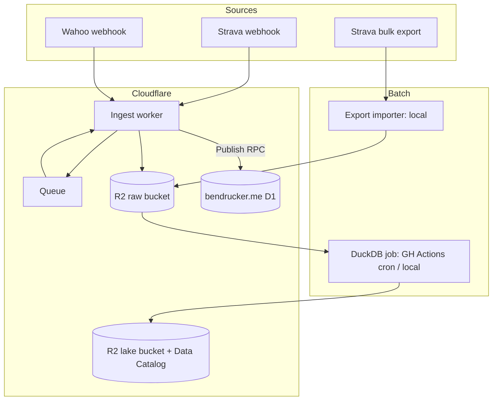

# Design

Activity Hub ingests my workout data from Strava and Wahoo, archives original files immutably, builds an analytics lake, and publishes a feed subset to bendrucker.me. This document records the architecture and the decisions behind it. Source API constraints live in [sources.md](sources.md).

## Goals

- Own the data. Original FIT/GPX/JSON files land in R2 and never leave. Every downstream artifact can be rebuilt from the raw bucket, so future feature engineering replays history instead of re-scraping APIs.
- Ingest all activity types from both sources. Transforms, lake tables, and the website feed are cycling-first, but nothing at the raw layer filters by sport.
- Make a decade of history queryable with DuckDB, including power data that Strava makes impractical to analyze in bulk.
- Feed bendrucker.me's `/activity/cycling` page within minutes of a ride upload.

## Non-Goals

- Analytics in D1. The website database gets feed-shaped rows only: summary stats, polylines, Strava IDs, photo URLs. Power analysis and multi-year queries run against the lake.
- Mirroring Strava's social graph. Titles and descriptions sync. Kudos and comments stay on Strava behind a permalink.
- Multi-user support. One athlete, my accounts, single-tenant everywhere.

## Architecture

Workers where events happen, DuckDB where columns happen.



#### Ingest Worker

One Worker exposes `/webhooks/strava` and `/webhooks/wahoo`, acks within Strava's 2-second deadline, and enqueues. Queue consumers do the real work:

- Strava events carry only IDs. The consumer fetches activity detail, streams, and photos, writes them to the raw bucket, and upserts the activity registry.
- Wahoo `workout_summary` events include the FIT file URL inline. The consumer downloads the FIT (exempt from rate limits) and archives it. Wahoo retries and can duplicate, so consumers are idempotent, keyed on source IDs.

The same consumer path publishes the feed row at event time. Garmin's FIT SDK is pure JavaScript, so parsing a ride summary inside the Worker is fine (single-digit MB files, well under the 128 MB memory cap on Workers Paid).

#### Raw Storage

The raw bucket is append-only and immutable. Objects are the original bytes from the source plus the API responses that described them.

```
raw/
  strava/
    export/{date}/...                      # unpacked bulk export archives
    activities/{strava_id}/detail.json
    activities/{strava_id}/streams.json
    activities/{strava_id}/photos/{photo_id}.jpg
  wahoo/
    workouts/{wahoo_id}/summary.json
    workouts/{wahoo_id}/original.fit
```

At ~3,700 activities and ~45 MB of files per the 2025 export analysis, a decade fits comfortably inside R2's 10 GB free tier.

#### Transform Job

A DuckDB batch job reads the raw bucket over `httpfs` (native R2 secret support), parses FIT files, and maintains Iceberg tables through R2 Data Catalog. DuckDB 1.5.3+ writes Iceberg REST catalogs natively, so the job runs anywhere DuckDB runs: GitHub Actions on a nightly cron, or my laptop for development and full-history rebuilds. FIT parsing uses `fitdecode` (or the DuckDB `fit` community extension if vetting shows it handles developer fields and gzipped files).

Replay is the point of this layer. Rebuilding the lake is rerunning the job against `raw/`, so schema changes and new feature engineering never require touching a source API.

#### Publishing

bendrucker.me exposes a named `WorkerEntrypoint` (`Publish`) that owns writes to its own D1. The hub binds it as a service and calls `publishActivity(row)` after ingest. The website owns its schema and migrations. The hub cannot corrupt them. A daily reconciliation cron re-publishes recent activities to heal missed webhooks.

## Data Model

#### Identity

The hub mints its own activity ID. Source records attach as overlays:

- `activities`: `activity_id` (hub-native), `started_at`, `timezone`, `sport`, `duration_s`
- `activity_sources`: `activity_id`, `source` (`strava` | `wahoo`), `source_id`, raw object keys

Wahoo and Strava describe the same physical ride, so ingest matches before minting: same sport class, start times within 2 minutes, durations within 5%. Wahoo wins for telemetry (original FIT). Strava wins for presentation (title, description, gear, photos). Activities that exist in only one source (manual Strava entries, workouts that never synced to Strava) are first-class.

The registry lives in the hub's own D1 database, which is operational state, not analytics. It answers "have I seen this source ID" and "which hub ID does this Strava ID map to" during ingest.

#### Lake Tables

Iceberg tables in R2 Data Catalog, maintained by the transform job:

- `activities`: one row per activity with summary metrics (distance, moving time, elevation, average/max power, heart rate, weather, training load from the export CSV)
- `records`: per-sample telemetry from FIT files (timestamp, position, altitude, power, heart rate, cadence, speed, temperature). This table answers stream-level questions like "hottest hour on a ride this year," so temperature and time live here from day one.
- `laps`: per-lap aggregates, cheap to carry from FIT

Plain date-partitioned Parquet under a `lake/` prefix is the fallback if the Data Catalog beta bites. The raw bucket makes that a rebuild, not a migration.

#### Feed Contract

The `Publish` RPC accepts a feed row: hub ID, Strava ID (for permalinks), name, sport, start time, distance, moving time, elevation gain, average power if present, encoded polyline, and photo URLs. The website renders from D1 alone.

## Backfill

The Strava bulk export is the canonical history. It contains original FIT files for Wahoo-recorded rides, full-resolution photos, and a CSV with richer metadata than the API returns (weather, training load, grade-adjusted pace).

- Request the export manually (no API exists) and stage the unpacked archive in `raw/strava/export/`.
- A local importer parses the CSV into the activity registry, moves FIT/GPX files into the raw layout, and generates polylines from track data for the feed.
- Wahoo backfill is best-effort: page `GET /v1/workouts` to the end, link matches to existing activities, and record how deep Wahoo's cloud history actually goes (undocumented).

The importer runs locally rather than in a Worker: the archive exceeds Workers' 100 MB request body limit, and a one-time job doesn't justify platform plumbing.

## Operations

- OAuth tokens for both sources live in Workers KV with refresh-before-use. Wahoo requires `offline_data` scope for background refresh and webhooks.
- Strava's June 2027 migration is designed in now: header-only auth and a configurable base URL (`www.api-v3.strava.com`).
- Wahoo production API access requires human approval. Apply immediately. Sandbox limits (25 req/5 min) may cover single-user use in the meantime.
- Cost: Workers Paid at $5/month covers the CPU budget for FIT parsing. R2, Queues, D1, and Data Catalog all sit inside free tiers at this scale.

## Risks

- Wahoo production approval is a human gate with unknown latency. Mitigation: apply first, build Strava ingest while waiting, verify sandbox suffices for one user.
- Wahoo cloud history depth is unverified. Mitigation: the Strava export is canonical history, so Wahoo backfill depth only affects source-overlay completeness.
- The Strava photos endpoint is undocumented and may break. Mitigation: photos also arrive full-resolution in each manual bulk export.
- R2 Data Catalog and R2 SQL are betas. Mitigation: raw bucket is the system of record; fall back to plain Parquet.
- Strava's API agreement bars AI/ML training on API data and its posture keeps tightening. Personal display and analysis of my own data is the sanctioned case, but the future LLM website feature should prefer lake data derived from my own files.

## Future Work

Deliberately out of scope until the pipeline is proven:

- Agent-driven analytics over the lake (R2 SQL as an HTTP query surface, or text-to-SQL against DuckDB).
- Precomputed stats JSON regenerated by the nightly job, which covers most website analytics with zero query cost.
- An LLM website feature answering questions about ride history. Inference cost is negligible (Workers AI free tier or Haiku-class API pricing). The design problem is bounding the query path, not paying for tokens.
