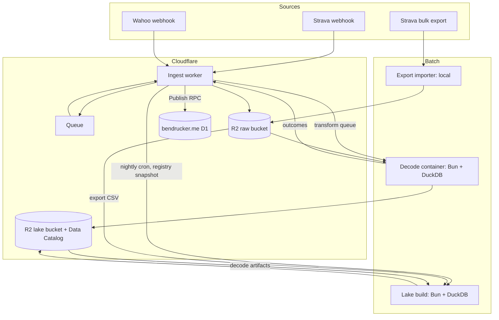

# Design

Activity Hub ingests my workout data from Strava and Wahoo, archives original files immutably, builds an analytics lake, and publishes a feed subset to bendrucker.me. This document records the architecture and the decisions behind it. Source API constraints live in [sources.md](sources.md).

## Goals

- Own the data. Original FIT/GPX/JSON files land in R2 and never leave. Every downstream artifact can be rebuilt from the raw bucket, so future feature engineering replays history instead of re-scraping APIs.
- Ingest all activity types from both sources. Transforms, lake tables, and the website feed are cycling-first, but nothing at the raw layer filters by sport.
- Make a decade of history queryable with DuckDB, including power data that Strava makes impractical to analyze in bulk.
- Feed bendrucker.me's `/activity/cycling` page within minutes of a ride upload.

## Non-Goals

- Analytics in D1. The website database gets feed-shaped rows only: summary stats, polylines, Strava IDs, photo URLs. Power analysis and multi-year queries run against the lake.
- Mirroring Strava's social graph. Titles and descriptions sync. Kudos and comments stay on Strava behind a permalink.
- Multi-user support. One athlete, my accounts, single-tenant everywhere.

## Architecture

Workers where events happen, DuckDB where columns happen.


```mermaid
flowchart TB
    subgraph sources [Sources]
        sw[Strava webhook]
        ww[Wahoo webhook]
        se[Strava bulk export]
    end
    subgraph cf [Cloudflare]
        ingest[Ingest worker]
        q[Queue]
        raw[(R2 raw bucket)]
        lake[(R2 lake bucket + Data Catalog)]
        d1[(bendrucker.me D1)]
    end
    subgraph batch [Batch]
        decode[Decode container: Bun + DuckDB]
        build[Lake build: Bun + DuckDB]
        importer[Export importer: local]
    end
    sw --> ingest
    ww --> ingest
    ingest --> q --> ingest
    ingest --> raw
    ingest -- Publish RPC --> d1
    se --> importer --> raw
    ingest -- transform queue --> decode
    raw --> decode --> lake
    decode -- outcomes --> ingest
    ingest -- nightly cron, registry snapshot --> build
    raw -- export CSV --> build
    lake -- decode artifacts --> build --> lake
```

#### Ingest Worker

One Worker exposes `/webhooks/strava` and `/webhooks/wahoo`, acks within Strava's 2-second deadline, and enqueues. Queue consumers do the real work:

- Strava events carry only IDs. The consumer fetches activity detail, streams, and photos, writes them to the raw bucket, and upserts the activity registry.
- Wahoo `workout_summary` events include the FIT file URL inline. The consumer downloads the FIT (exempt from rate limits) and archives it. Wahoo retries and can duplicate, so consumers are idempotent, keyed on source IDs.

The same consumer path publishes the feed row at event time. Garmin's FIT SDK is pure JavaScript, so parsing a ride summary inside the Worker is fine (single-digit MB files, well under the 128 MB memory cap on Workers Paid).

#### Raw Storage

The raw bucket is append-only and immutable. Objects are the original bytes from the source plus the API responses that described them.

```
raw/
  strava/
    export/{date}/...                      # unpacked bulk export archives
    activities/{strava_id}/detail.json
    activities/{strava_id}/streams.json
    activities/{strava_id}/photos/{photo_id}.jpg
  wahoo/
    workouts/{wahoo_id}/summary.json
    workouts/{wahoo_id}/original.fit
```

The 2026 bulk export measured 4,118 activities and ~876 MB unpacked ([export.md](export.md)), so a decade fits comfortably inside R2's 10 GB free tier.

#### Transform Job

The unit of work is one activity at one stage, and the DAG is data-driven rather than scheduled. Nothing runs because a clock said so. Work happens because a stage's recorded output is missing or older than its input.

A `derived` table in D1 carries one row per `(activity_id, stage)` with an `input_fingerprint` hashed over the raw R2 keys and etags that fed it. An upstream edit changes an etag, the fingerprint stops matching, and every downstream stage is stale by definition. A second column, `artifact_version`, records the shape of what the stage wrote. A decoder that gains a column leaves the artifacts written before it unreadable by a lake build that expects the column, and no etag moves to say so. It is a column rather than another input to the hash because the sweep has to compare it in SQL: nothing else would ever select the rows a decoder change invalidated, so bumping it is what re-runs the corpus. Reprocessing one activity is deleting its rows or enqueueing it directly, because the stage is idempotent on that key.

Decoding runs in a container rather than in Workers, on a `activity-hub-transform` queue with its own dead letter queue. The container takes a batch of work descriptors over HTTP, writes Parquet to R2, and returns outcomes. It never writes D1 and never reads the queue, so every state transition stays in the Worker and a container crash costs time rather than data. Cloudflare bindings do not cross into a container, so it reaches both buckets over the S3 API using two scoped tokens: read on `activity-hub-raw`, write on `activity-hub-lake`.

The container is billed on how long it is up, not on what it does: memory and disk accrue against wall clock and only vCPU accrues against work. An idle instance therefore costs the same as a busy one, and 25 GiB-hours of free memory is four hours of uptime a month at 6 GiB. Sleeping is a SIGTERM with no SIGKILL behind it, so the process handles the signal and exits. One that ignored it would run until the platform reaped it, and the first evidence would be the bill. The one deliberate exception is a lake build in flight: the process defers its exit until the build settles, because the sleep signal carries no deadline and the alternative is a half-written table. A platform stop, which does escalate to SIGKILL after 15 minutes, still kills a mid-build, and the next nightly heals it. A watchdog in the Durable Object backstops the deferral: three hours after each container start it destroys the instance if it is still running, so a hung build cannot hold the instance past triple its normal length.

Bun decodes rather than DuckDB's `fit` community extension, which reads no GPX (574 corpus files) and exposes no developer fields. Its 1.0.2 release reads `.fit.gz`, which it could not when this was decided. The deciding factor is duplication: the sport mapping, timezone inference, and track extraction in `src/import/` would otherwise exist twice, in TypeScript and in SQL, and drift. Decoding the entire history takes 113 seconds single-threaded, so this is not a performance call.

Replay is the point of this layer. Rebuilding the lake is rerunning the stages against `raw/`, so schema changes and new feature engineering never require touching a source API.

#### Archive Tiers

Not every activity has a file to parse, and the ones that don't are mostly not defects. The job reads `activity_sources.raw_keys` to learn what exists for an activity, and handles four tiers.

An `original` key means a FIT or GPX, from the Strava bulk export or from Wahoo. This is the richest input and covers most of the history. A `streams` key means Strava's per-second arrays, written by the webhook consumer. Fidelity is close to a FIT for everything the lake models, missing only developer fields.

A `detail` key with no `original` and no `streams` means a **manually entered Strava activity**. These carry `manual: true` with `upload_id`, `external_id`, and `device_name` all null, and Strava's streams endpoint answers 404 for them. No file was ever created, so `detail.json` is the complete record: distance, elapsed time, and title, with no per-second data. Treat these as summary rows rather than as parse failures.

A Wahoo `summary` key with no `original` means the device registered a workout it never produced a file for. Some carry usable metrics. Many carry null distance, duration, and power.

#### Quality Filters

Two populations distort aggregates and belong outside anything published.

Zero-duration activities are device artifacts. They cluster at duplicate start timestamps, the signature of an ELEMNT emitting several empty workouts at once.

Activities running past a day were never stopped. The extreme case starts 2016-01-01 and claims 10,452,264 seconds. That is 121 days. Set the cut well above twelve hours, because an eight-to-twelve-hour day is a real ride and has to survive it.

Both populations are flagged in the lake rather than dropped from a table. Filtering happens at the publish and aggregate boundary, so a row the current thresholds reject stays inspectable.

#### Where Metadata Lives

Titles, descriptions, gear, and full-resolution photos come from the export tree at `raw/strava/export/{date}/`, chiefly `activities.csv`. Per-activity `detail.json` exists only for activities the webhook path or a backfill has touched, so the job reads the export for history and `detail.json` for anything newer than the last export.

#### Publishing

bendrucker.me exposes a named `WorkerEntrypoint` (`Publish`) that owns writes to its own D1. The hub binds it as a service and calls `publishActivity(row)`, `publishPowerCurve(activityId, bests)`, and `deleteActivity(activityId)`. The website owns its schema and migrations. The hub cannot corrupt them.

The binding carries no credential and gives the callee no caller identity, so holding one is the authorization and any Worker on the account can hold one. The method list is therefore the entire security boundary: one activity per call, upsert and delete only, no bulk write and no read. Every field is validated by name on arrival. A shape violation throws `ValidationError`, and the hub branches on that name to park the activity instead of retrying a row that will never be valid, because an error's `name` and `message` are all that cross the boundary.

Rows carry SI units. The hub is the system of record and stores SI, so converting on the way out would put rounding somewhere neither side can check.

## Data Model

#### Identity

The hub mints its own activity ID. Source records attach as overlays:

- `activities`: `activity_id` (hub-native), `started_at`, `timezone`, `timezone_inferred`, `sport`, `duration_s`
- `activity_sources`: `activity_id`, `source` (`strava` | `wahoo`), `source_id`, raw object keys

Wahoo and Strava describe the same physical ride, so ingest matches before minting: same sport class, start times within 2 minutes, durations within 5%. Wahoo wins for telemetry (original FIT). Strava wins for presentation (title, description, gear, photos). Activities that exist in only one source (manual Strava entries, workouts that never synced to Strava) are first-class.

The registry lives in the hub's own D1 database, which is operational state, not analytics. It answers "have I seen this source ID" and "which hub ID does this Strava ID map to" during ingest.

#### Lake Tables

The lake stage rebuilds every table from the decode artifacts on its own nightly cron, two hours after the sweep that enqueues decoding. A full rebuild takes about 55 minutes over the whole corpus, which is still cheaper than the bookkeeping an incremental merge would need to stay correct when an upstream edit rewrites an activity.

That runtime is far past the 15-minute wall clock a cron invocation gets, so no caller waits for the build. The Worker POSTs the request and the container answers as soon as it accepts, refusing with a busy answer while a build is already running. The build itself runs in the background and settles into a summary object at `lake/builds/latest.json`, outside `lake/v1/` so no table glob reads it, carrying the start and finish times plus the per-table row counts on success or the error on failure. `GET /admin/lake` reads it back, which alongside container logs is where a build's outcome is checked.

The build reads only R2. The registry reaches it as a newline-delimited JSON snapshot the Worker exports from D1 for each run, which keeps the container free of bindings and pins what a given build saw. Tables land under `lake/v1/` as ZSTD Parquet, with `records` partitioned by year:

- `activities`: one row per activity, carrying Strava's numbers and the device's under separate names, plus `power_source`, `telemetry_origin`, `telemetry_format`, `telemetry_raw_key`, and `deleted_at`. Strava's numbers come from the archived export CSV, joined on the registry's Strava id. Device numbers come from the session rows, summed across a file's sessions with the averages weighted by timer time. An activity the registry holds but nothing decoded still gets a row.
- `records`: per-sample telemetry (timestamp, position, altitude, power, heart rate, cadence, speed, temperature), plus a map column holding developer fields verbatim. This table answers stream-level questions like "hottest hour on a ride this year," so temperature and time live here from day one.
- `laps`, `sessions`: per-lap and per-session aggregates, cheap to carry from FIT.
- `meta`: one row per device and per developer field descriptor, which is what makes `telemetry_raw_key` and the developer field inventory queryable without opening record files.
- `power_curve`: best power across nineteen durations from 5 s to 60 min, one row per activity per duration, tagged with `power_source` so estimated-power rides are marked rather than excluded. Windows roll over a zero-filled 1 Hz elapsed grid, which is what makes a paused ride's two ten-minute efforts fail to add up to a twenty-minute one.

Every column is marked with the provenance of its input, file-derived or API-derived. Strava's agreement bars AI/ML training on API-derived data, so a future LLM feature bounds itself with a `WHERE` clause instead of a schema migration.

Publishing these tables to R2 Data Catalog as Iceberg is the next step and the design's stated preference. DuckDB's `iceberg` extension installs and loads under the version the container runs, and registers the secret type the catalog needs. The image installs only `httpfs` today, so what remains is adding the extension there and writing against a live catalog. Plain Parquet under `lake/v1/` is what ships until that is proven, and the raw bucket makes the switch a rebuild rather than a migration.

#### Feed Contract

The `Publish` RPC accepts a feed row: hub ID, Strava ID (for permalinks), name, sport, start time, timezone, distance, moving time, elevation gain, average power and its source, an encoded polyline, an elevation profile, and photo keys. Power-curve bests arrive as a second call, replacing the activity's rows outright. The website renders from D1 alone and derives every aggregate itself.

The polyline holds every tenth track point, which keeps a five-hour ride under two kilobytes and renders identically at map scale. The elevation profile is 100 altitudes in metres spaced by distance rather than by time, so a climb occupies the width it covers on the map instead of the width it took to ride.

Photos serve from the raw bucket through a route on the website that matches the whole photo key, since the binding it uses reaches every raw telemetry file.

The registry answers when and what sport. The container answers everything only the telemetry knows, including the device's own distance, elevation, and moving time. Strava's archived `detail.json` supplies the title, and stands in for the totals when a file carries records but no session summary.

With no decode artifact, publish falls back to whatever the provider archived beside the file: `detail.json` first, then a Wahoo `summary`, which carries the recorded minutes and nothing else. The fallback opens once decode has settled, which covers an activity that never had an original and one whose original decode read and could not parse. Waiting on a decode that already gave up strands the activity permanently, which is what happened to the single TCX in the archive.

A Wahoo summary reporting zero minutes is an aborted or never-stopped recording. Elapsed time accrued while the head unit captured nothing, so it stays off the site and keeps its registry row.

## Transform Decisions

Measurements against the local export settled these. They are recorded because the reasoning is not recoverable from the schema.

#### Freshness

A ride reaches the website within minutes, without a provisional row and without a `revision` column. Publish is a per-activity stage reading the decode artifact, so it runs the moment decode finishes rather than waiting on the corpus-wide lake rebuild, and a successful decode enqueues it directly.

Correctness still comes from the table rather than the chain. An activity whose decode row is newer than its publish row is stale, so a dropped chain message, a decoder bump, or a re-decode all heal on the next sweep. The chain only supplies latency.

#### Whose Numbers

Strava and the device disagree, and not slightly: normalized power matches Strava's weighted average on 0.3% of rides, a median 17 W apart, and average power matches on 2.6%. Distance and elevation are effectively passthrough. The lake carries both with explicit provenance. The website shows the device's own totals where it recorded them, falling back to Strava's for a file that carries records but no session summary, matching how the lake's `activities` table resolves the same disagreement. Analytics uses device numbers so results stay internally consistent and reproducible from files I own. Anything published as a headline stat names which one it used.

#### Estimated Power

573 GPX rides carry Strava-estimated power, and only 2,826 of 4,118 activities have real samples. A `power_source` column records measured, estimated, or none. Power aggregates exclude estimated unless a query opts in.

#### Telemetry Precedence

An activity can hold a Wahoo FIT, an export FIT, a GPX, and Strava streams at once, and exactly one of them produces the `records` rows. Precedence is Wahoo FIT, export FIT, Strava streams, then GPX, recorded per activity as `telemetry_origin` and `telemetry_format`. GPX ranks below streams because it carries no power.

#### Records Schema

The FIT record message has 79 possible columns and ours reliably fill about 15. Those get typed columns. Developer fields ride on most records since 2020, including Wahoo wind and air speed, so a fixed column list would drop real data: they land in a map column verbatim. Promoting any of them to a real column waits for a question that needs it.

#### Iceberg

R2 Data Catalog is beta, and with a single writer, a nightly cadence, and a two-minute full rebuild, Iceberg's incremental merges and time travel are not yet load-bearing. It wins anyway because R2 SQL and any future engine read it for free, and because the raw bucket makes abandoning it a rebuild rather than a migration.

#### Website Scope

Every ride since 2013. All 4,118 rows with polylines decimated to every tenth point land around 20 MB in D1, well inside limits. Store SI units and format in the component.

#### Photos

Photo bytes serve from R2 through a site route. Strava CDN URLs are undocumented and may expire, and the hub already archives the bytes at full resolution.

#### Deletes and Edits

A Strava delete soft-deletes the source row. The lake keeps the row with `deleted_at` set, because the files still exist and history should not shift under a query that ran yesterday. The website deletes it.

## Backfill

The Strava bulk export is the canonical history. It contains original FIT files for Wahoo-recorded rides, full-resolution photos, and a CSV with richer metadata than the API returns (weather, training load, grade-adjusted pace).

- Request the export manually (no API exists) and stage the unpacked archive in `raw/strava/export/`.
- A local importer parses the CSV into the activity registry, moves FIT/GPX files into the raw layout, and generates polylines from track data for the feed.
- Wahoo backfill is best-effort: page `GET /v1/workouts` to the end, link matches to existing activities, and record how deep Wahoo's cloud history actually goes (undocumented).

The importer runs locally rather than in a Worker: the archive exceeds Workers' 100 MB request body limit, and a one-time job doesn't justify platform plumbing.

## Operations

- OAuth tokens for both sources live in a `TokenBroker` Durable Object, one instance per source, with refresh-before-use. Wahoo rotates the refresh token on every refresh and revokes the grant when it sees one reused, so refreshes have to be serialized: KV reads go up to 60 seconds stale, which let two invocations send the same pair. Durable Object storage is strongly consistent and a named instance gives one refresh at a time. The broker seeds itself from the KV keys the pairs used to live under and mirrors every pair back to them, so rolling the deploy back leaves the older code reading a current refresh token rather than a spent one. Nothing else reads KV. Wahoo requires `offline_data` scope for background refresh and webhooks.
- Strava's June 2027 migration is designed in now: header-only auth and a configurable base URL (`www.api-v3.strava.com`).
- Wahoo production API access requires human approval. Apply immediately. Sandbox limits (25 req/5 min) may cover single-user use in the meantime.
- Cost: Workers Paid at $5/month covers the CPU budget for FIT parsing. R2, Queues, D1, and Data Catalog all sit inside free tiers at this scale.

## Risks

- Wahoo production approval is a human gate with unknown latency. Mitigation: apply first, build Strava ingest while waiting, verify sandbox suffices for one user.
- Wahoo cloud history depth is unverified. Mitigation: the Strava export is canonical history, so Wahoo backfill depth only affects source-overlay completeness.
- The Strava photos endpoint is undocumented and may break. Mitigation: photos also arrive full-resolution in each manual bulk export.
- R2 Data Catalog and R2 SQL are betas. Mitigation: raw bucket is the system of record; fall back to plain Parquet.
- Strava's API agreement bars AI/ML training on API data and its posture keeps tightening. Personal display and analysis of my own data is the sanctioned case, but the future LLM website feature should prefer lake data derived from my own files.

## Future Work

Deliberately out of scope until the pipeline is proven:

- Agent-driven analytics over the lake (R2 SQL as an HTTP query surface, or text-to-SQL against DuckDB).
- Precomputed stats JSON regenerated by the nightly job, which covers most website analytics with zero query cost.
- An LLM website feature answering questions about ride history. Inference cost is negligible (Workers AI free tier or Haiku-class API pricing). The design problem is bounding the query path, not paying for tokens.
